# Fission

Nuclear reactors for **Minecraft 26.3** (Fabric). Build a core from fuel channels, graphite, beryllium
reflectors and control rods. Fill it with water, pull the rods, and the chain reaction starts: delayed
neutrons, Doppler feedback, xenon, decay heat. Steam drives turbines whose generators feed the
**Gridworks** grid. A control room with a SCRAM button, annunciators and a core map keeps it in check.
Spent fuel is full of real fission products with real half-lives, which go into holding basins and
storage drums. Lose the cooling and the core melts into corium; make it prompt critical and it blows
the roof off and throws burning graphite and fuel far over the land, unless the roof is thick concrete;
a radioactive cloud then drifts downwind and leaves fallout behind. All radiation goes through the
**Radiation** mod.

Online handbook: https://mchamradio.antwire.net/handbook/fission/
Source code: [github.com/Lamisator/fission](https://github.com/Lamisator/fission)

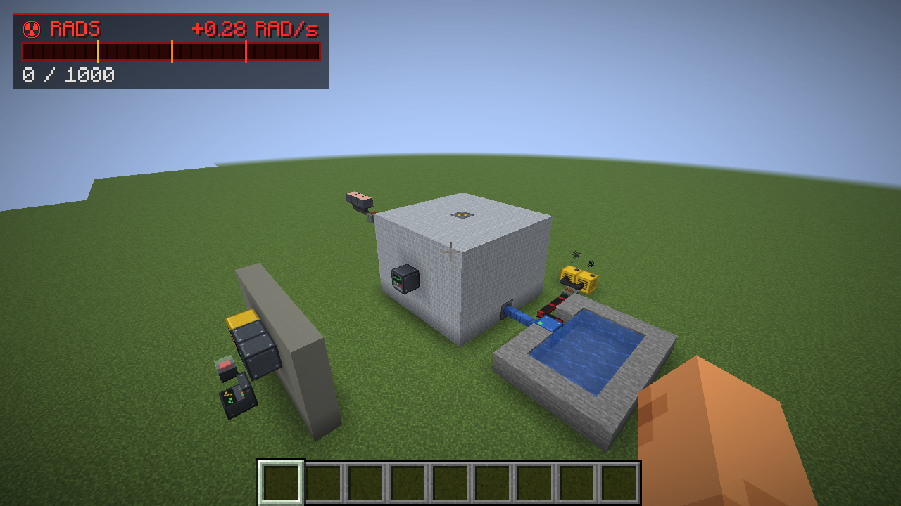

## Installing

Fission needs **Fabric API**, **Gridworks 1.1.2** or newer and **Radiation 1.5.0** or newer.

1. In Prism Launcher, make a Minecraft **26.3** instance with **Fabric** (loader 0.19.5 or newer).
2. **Edit → Mods → Download mods**: install **Fabric API**.
3. **Add file**: `gridworks-1.1.2.jar`, `radiation-1.5.0.jar` and `fission-1.2.1.jar`.

For a server, put the same jars into its `mods` folder. Every player needs them too.

## From ore to fuel

| Step | How |
|---|---|
| Uranium ore | Deep underground, below Y 16 (stone and deepslate). Drops raw uranium. |
| Yellowcake | Smelt raw uranium (natural uranium oxide, 0.7 % U-235). |
| Enriched uranium | **Gas centrifuge** (230 V, 2 kW from Gridworks): 4 yellowcake → 1 enriched (3.5 %) + 3 depleted uranium, 20 s. |
| Zircaloy cladding | 2 iron + 1 quartz → 4. |
| Fuel assemblies | 3 yellowcake (natural), 3 enriched (LEU) or 1 plutonium + 2 depleted uranium (MOX), each with 6 cladding. |
| Graphite | Coal blocks in a blast furnace. |
| Beryllium | Emeralds are beryl: 4 emerald + 5 iron → 4 reflectors. |

| Fuel | U-235 / Pu-239 | Life | Notes |
|---|---|---|---|
| Natural uranium | 0.7 % | 4 MWd | Only goes critical in a big, well-moderated graphite pile (5×5×5 channels or more). |
| LEU | 3.5 % | 15 MWd | The standard fuel; small cores go critical. |
| MOX | 6 % Pu | 12 MWd | Made from plutonium recovered by reprocessing. |

## Building a reactor

A reactor is a connected lump of core blocks. The **Reactor Controller** placed against it finds
every connected one:

- **Fuel Channel**: holds one fuel assembly; nominally 1 MW thermal each. Glows blue when fissioning.
- **Control Rod**: boron carbide absorber; the controller drives all of them together.
- **Graphite Moderator**: slows neutrons down without absorbing them. Put it between the channels.
- **Beryllium Reflector**: sends escaping neutrons back. Wrap the core in it.
- **Reactor Vessel**: plain steel wall.
- **Feedwater Inlet**, **Steam Outlet**, **Pressure Relief Valve**: vessel blocks with nozzles.

The neutron balance is worked out block by block. Neutrons leave a fuel channel through its six
faces. Graphite and beryllium scatter them back (and slow them down); water in the channels slows
them a little and absorbs some; control rods absorb them; anything else lets them leak away. Slow
neutrons reaching fuel cause far more fissions than fast ones. So the arrangement matters, as in a
real core:

- A single channel is far from critical (k ≈ 0.1). Channels must share neutrons.
- Graphite between channels (every second block) is a classic lattice.
- A reflector shell adds several percent.
- Rods between fuel channels are worth much more than rods at the edge.
- **Void coefficient**: in a graphite core, boiling away the water makes it *more* reactive (the water
  was mostly absorbing), like the RBMK. In a core moderated by water alone, it makes it less reactive.

**A starter reactor** (the one in the screenshots): 3×3 columns of LEU fuel channels, 3 high, every
second block in each direction (pitch 2), graphite everywhere in between, eight control rod columns
in the gaps on the outer ring, and a beryllium shell all round. In that shell: a feedwater inlet low on
one side, a steam outlet on the other, a relief valve on top, and the controller against it. It has
27 MW nominal; it is critical with the rods about 27 % in when cold (k = 1.11 with rods out, 0.89
with rods in).

```
 top view, one layer      F fuel channel   G graphite   R control rod   B beryllium
   B B B B B B B
   B F R F R F B
   B R G G G R B
   B F G F G F B
   B R G G G R B
   B F R F R F B
   B B B B B B B
```

## Physics

Everything that matters for running a reactor is simulated:

- **Point kinetics with delayed neutrons** (β = 0.65 %). Below prompt critical, the power changes with a
  period of tens of seconds and can be controlled. Above it (reactivity over 650 pcm) it runs away in
  milliseconds and the reactor explodes.
- **Doppler feedback**: −2.5 pcm per °C of fuel temperature. A hot core is less reactive.
- **Xenon-135**: builds up from iodine at power. After a shutdown it peaks for a few Minecraft hours and
  can make a restart impossible for a while (the "iodine pit").
- **Decay heat**: after a SCRAM about 6.5 % of the power keeps coming, falling to 1 % over a few minutes
  and slowly after that. The core still needs cooling.
- **Burnup**: every assembly burns down and fills with fission products (see below).
- A **start-up neutron source** keeps a few watts going in a shut-down core.

Kinetics run in real time. Slow things (burnup, decay heat, xenon, isotopes) run on game time, where a
Minecraft day is 24 hours, like Gridworks' energy.

## Steam, turbines and electricity

| Block | What it does |
|---|---|
| **Feedwater Pump** | Pumps up to 20 kg/s from water next to it. Needs **10 kV** from Gridworks: about 9 kW per kg/s against 70 bar, much less while filling. Short of power, it slows down. Redstone stops it. |
| **Feedwater Pipe** (blue) | From the pumps to the reactor's feedwater inlet. |
| **Steam Pipe** (silver) | From the steam outlet to turbines and condensers. 40 kg/s per network. |
| **Steam Turbine** | Spins up to 3000 rpm on steam once the reactor has 40 bar. Shaft end is its front. |
| **Turbine Generator** | On the turbine's shaft end: up to **5 MW at 10 kV** into Gridworks once synchronised. Put a substation transformer straight onto it for 110 kV, or MV cable. |
| **Condenser** | Turbine bypass: above 70 bar it takes the steam the turbines do not need. 20 kg/s with cooling water next to it, 3 kg/s air-cooled. |
| **Pressure Relief Valve** | Blows off steam above 85 bar (and loses that water). Without one, the vessel bursts at 150 bar. |

The core holds 100 kg of water per fuel channel. It heats up, boils (1 MW makes 0.5 kg/s of steam)
and builds pressure; the turbine takes what its generator delivers, 0.7 MJ of electricity per kg of
70 bar steam (about 35 %). The pumps run on 10 kV, so a plant needs outside power to start, then can
run its pumps from its own generator.

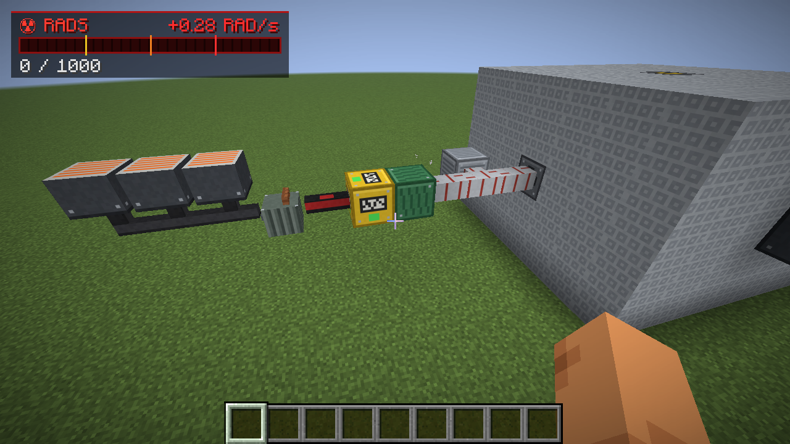

## The control room

Wire control room equipment to the reactor with the **Data Cable**: use it on the reactor controller,
then on each piece.

- **Reactor Control Console** (or the controller itself): the control panel.
  - Thermal power, reactivity (pcm and k-eff), period, rod position; a two-minute power trend.
  - Gauges: hottest fuel temperature, pressure, water level, steam and feed flow, xenon, decay heat.
  - Core map: every fuel channel's power, coloured from blue to red.
  - **Rods**: drag the slider, or IN/OUT in 1 % and 5 % steps. The drives move 0.5 %/s.
  - **AUTO**: holds the power setpoint (÷2 / ×2) with the rods, never faster than about a 33 s period.
  - **RPS ON / BYPASS**: the reactor protection system. Bypassing it is how Chernobyl happened.
  - **SCRAM**: lift the guard, press the button. All rods drop in within three seconds. **RESET** once
    the rods are in and nothing calls for a SCRAM.
- **SCRAM Button**: a pedestal with a big red mushroom button under a hinged guard. Use once to
  lift the guard, again to press. A redstone signal works too.
- **Annunciator Panel**: twelve alarm windows; serious ones flash red.
- **Core Map**: the channel powers on a wall panel.
- **Area Radiation Monitor**: shows the dose rate in front of it. It flashes and beeps above its
  threshold (sneak-use: 0.1 / 1 / 10 / 100 rad/s). A comparator reads it on a log scale.

The controller also takes a redstone signal (SCRAM) and gives a comparator signal (15 = 100 % power).

| Control room | The console at 8 MW | After a SCRAM |
|---|---|---|
| 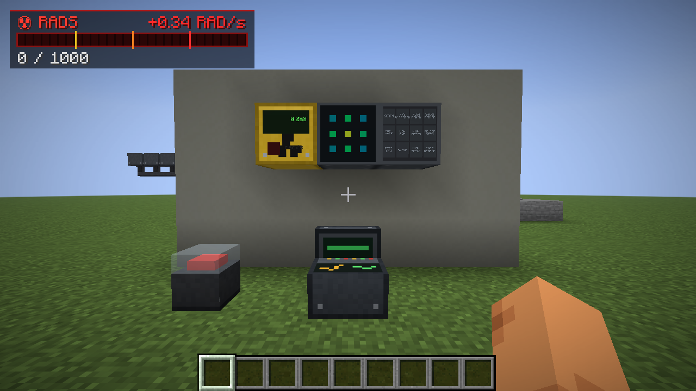 | 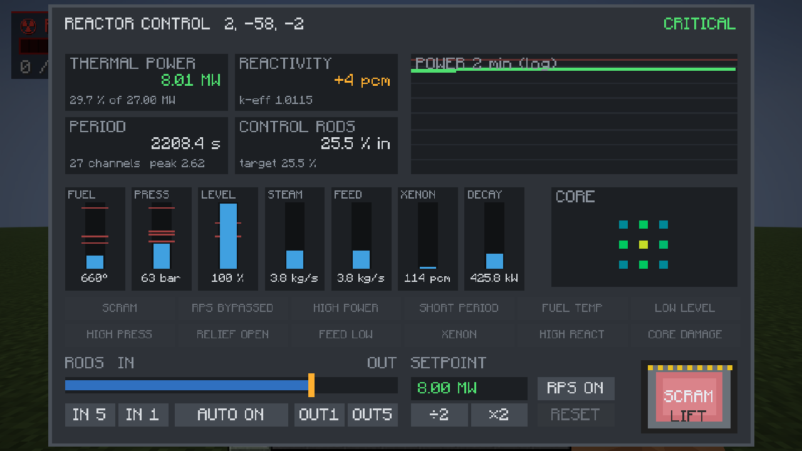 | 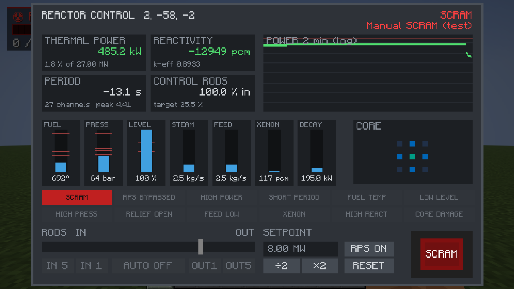 |

**Reactor protection system**: SCRAMs on power over 115 %, a period under 10 s, hottest fuel over
1500 °C, water level under 50 % (with rods out or power on), or pressure over 95 bar.

| Alarm | When |
|---|---|
| SCRAM | Rods dropped |
| RPS BYPASSED | Protection system off |
| HIGH POWER | Over 100 % |
| SHORT PERIOD | Period under 30 s |
| FUEL TEMP | Hottest fuel over 1200 °C |
| LOW LEVEL | Water under 70 % |
| HIGH PRESS | Over 80 bar |
| RELIEF OPEN | Relief valves blowing |
| FEED LOW | Feedwater well below the steam flow |
| XENON | Xenon worth over 500 pcm |
| HIGH REACT | Reactivity over half of β |
| CORE DAMAGE | Fuel has melted |

## Fission products

Every fission splits uranium into two lighter atoms. Each assembly tracks the real build-up and
decay of the important ones, from their real fission yields and half-lives. The dose rates use
their real gamma constants.

| Isotope | Half-life | Yield | Storage |
|---|---|---|---|
| Mo-99 | 66 h | 6.1 % | holding basin |
| Te-132 (I-132) | 3.2 d | 4.3 % | holding basin |
| Xe-133 | 5.2 d | 6.7 % | holding basin |
| I-131 | 8.0 d | 2.9 % | holding basin |
| Ba-140 (La-140) | 12.8 d | 6.2 % | holding basin |
| Ru-103 | 39 d | 3.0 % | holding basin |
| Zr-95 (Nb-95) | 64 d | 6.5 % | holding basin |
| Ce-144 | 285 d | 5.5 % | holding basin |
| Ru-106 | 1.0 y | 0.4 % | storage drum |
| Cs-134 | 2.1 y | (activation) | storage drum |
| Kr-85 | 10.7 y | 0.29 % | storage drum |
| Sr-90 | 28.8 y | 5.7 % | storage drum |
| Cs-137 | 30.1 y | 6.1 % | storage drum |
| Sm-151 | 90 y | 0.42 % | storage drum |
| Am-241 | 432 y | (actinide) | storage drum |
| Pu-239 | 24 110 y | (bred from U-238) | plutonium, for MOX |
| Tc-99 | 211 000 y | 6.1 % | storage drum |
| I-129 | 15.7 million y | 0.7 % | storage drum |

Because time runs at Minecraft speed, I-131 is gone after a few Minecraft weeks; Cs-137 never.

**How dangerous**: radiation counts in the Radiation mod's rads (1 Sv ≈ 100 rad, at game time). An
assembly that has run 15 MWd and cooled for a day gives about **1 700 rad/s at one metre**: death in
under a second. Carried in the inventory it is four times that. Fresh fuel is harmless (MOX a little).
Hazmat suits and Rad-X help as with any radiation. Concrete, water and heavy materials shield (see
Radiation 1.5.0: three blocks of concrete leave 0.1 %).

## Handling fuel and waste

| Block | |
|---|---|
| **Fuel Rack** | Fresh fuel. Sends it down fuel transfer tubes to empty fuel channels. |
| **Fuel Transfer Tube** | Moves fuel assemblies. Spent assemblies leave the fuel channels by tube on their own (on-load refuelling). A column of stacked fuel channels is one pressure tube: assemblies travel up and down through it, so one tube on top of each column reaches every channel in it. |
| **Holding Basin** | A pool for short-lived isotopes and spent fuel; the water lets through only 0.02 %. Canisters that have decayed become harmless empty canisters. Spent fuel that has cooled for a day goes on by tube to reprocessing. |
| **Reprocessing Plant** | 230 V, 3 kW, heavily shielded (5 % gets out). Dissolves a cooled spent assembly into one canister per isotope, with as much as the rod really holds, plus plutonium and depleted uranium. Sends them out by isotope pipe. |
| **Isotope Pipe** | Moves canisters, plutonium, depleted uranium and debris. Each item goes to the nearest block that takes it. |
| **Long-Term Storage Drum** | For long-lived isotopes, plutonium and debris. It holds back about 97 % of the radiation, not all of it. Put drums behind concrete. |

Short-lived isotopes (half-life under a year) go only into holding basins, long-lived ones only into
drums. Tooltips show each canister's isotope, half-life, activity and dose rate.

| Fuel cycle | Reprocessing output | Holding basin | Storage drum |
|---|---|---|---|
| 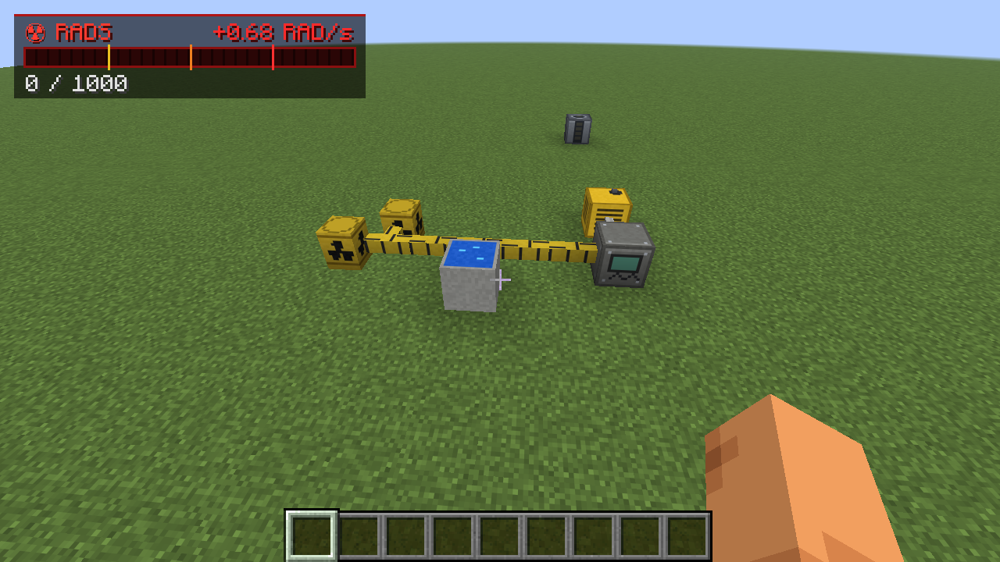 | 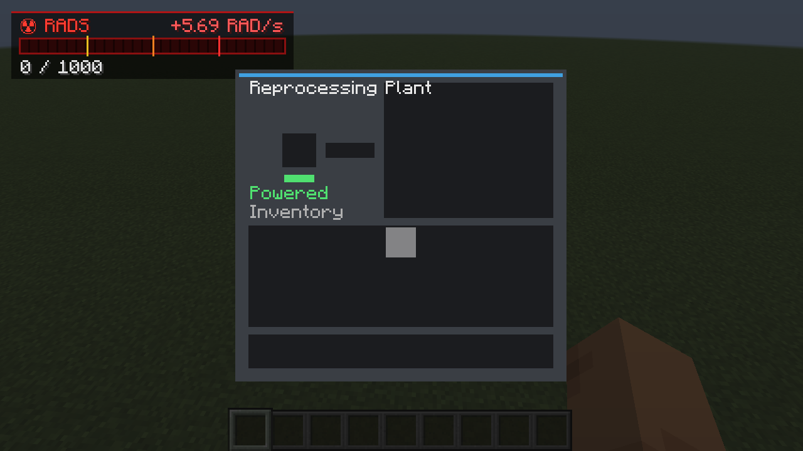 | 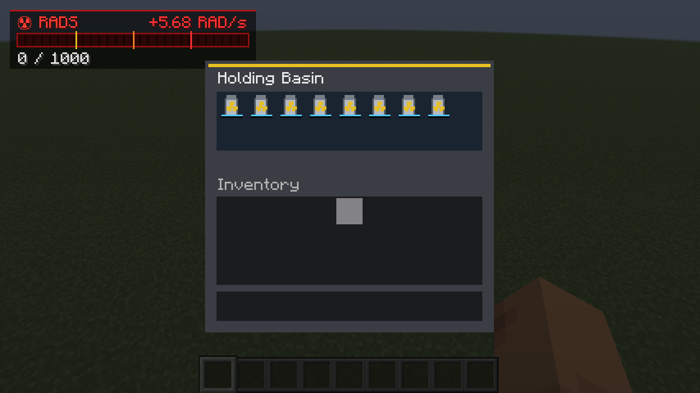 | 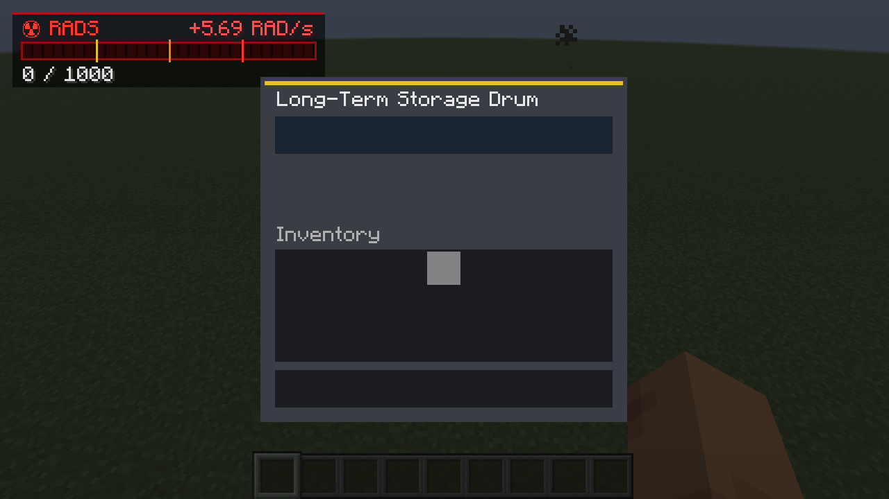 |

## Accidents

### Meltdown

Without cooling, the fuel heats up, even after a SCRAM (decay heat). Above **2800 °C** a channel's
fuel melts into **corium**:

- It sinks, melting down through most blocks (stone in seconds, concrete only slowly; reinforced and
  heavy concrete hold it for many minutes, bedrock for ever).
- While hot it spreads into a puddle.
- **Water within two blocks flashes to steam instantly.**
- It sets things on fire and kills anything that touches it (lava damage, far worse inside it).
- It radiates about 450 rad/s at one metre.
- After about a quarter of an hour it solidifies into **solidified corium**, the elephant's foot,
  still 100 rad/s at one metre. Mining it gives corium fragments you should not carry.

| Melted core | Corium on concrete, boiling a pond |
|---|---|
| 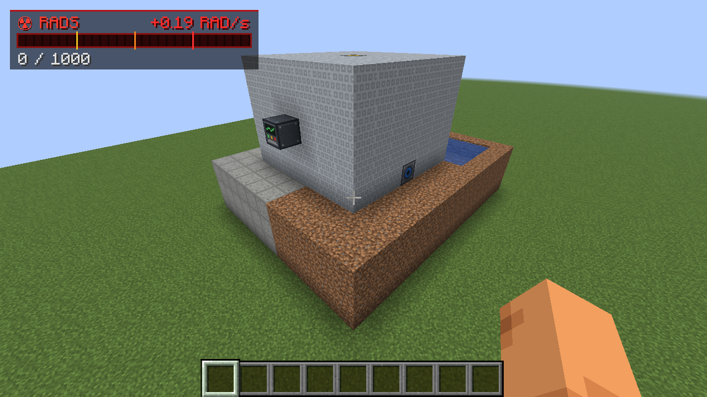 | 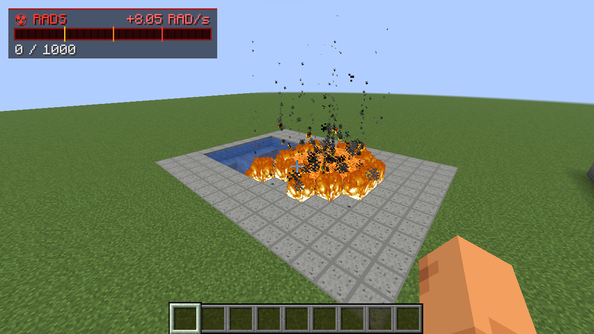 |

### Explosion

A prompt critical excursion (power over 25 times nominal) or a burst vessel (over 150 bar) blows the
reactor up. The more reactivity drove it, the harder: severity 1.0 just past prompt critical, up to 1.4
when all rods come out at once (a burst vessel is 0.5).

**The blast.** It pushes up and outwards in a cone, followed 64 blocks up and as far to the side. Every
column of blocks in that cone must absorb its share: the full blast right above the core (a full
excursion of a 27-channel core needs about **340** per column, a 108-channel core about **650**), less
further to the side and only from the height the cone reaches there. Air does not count, so a hall roof
25 blocks up is just as exposed as a lid on the core.

| Block | Absorbs |
|---|---|
| Heavy concrete (Radiation) | 140 |
| Reinforced concrete (Radiation) | 120 |
| Obsidian | 100 |
| Iron / gold / netherite block | 50 |
| Concrete (any colour) | 20 |
| Stone, deepslate, bricks | 8 |
| Dirt, sand, wood… | 1–2 |

Columns that hold stay put. Columns that cannot are **thrown into the air block by block**, up to about
100 blocks high; what is too much to throw (more than 900 blocks) shatters. Three to four layers of
reinforced concrete hold a 27-channel core; earth roofs and ordinary hall roofs do not.

**The core.** Where it is open to the sky, the burning core throws out **irradiated graphite** (30 rad/s at
one metre) and **fuel fragments** (50 rad/s at one metre), up to 400 pieces, 50 to 250 blocks high and up
to 300 blocks far, a third of them downwind. They radiate wherever they land, burning graphite sets roofs
and fields on fire, and picking them up is a bad idea. The rest of the fuel becomes corium. The open shaft
itself radiates about 4 rad/s per fuel channel, fading over days.

**The fire.** The graphite left in the shaft **keeps burning**, as it did for ten days at Chernobyl: flames on
the core and a column of black smoke above it. Under a roof the smoke stays in the building. Where the core is
open to the sky - right after the explosion, or later when someone takes the roof off - the smoke rises 40 blocks
into the sky and carries the radioactivity away: half of it goes up with the explosion as a big **radioactive
cloud**, and from then on another cloud every half minute, a continuous trail downwind for as long as the fire
burns. The fire weakens over days and burns out after ten.

**Putting it out** works as it did then: **smother it**. Dump sand, gravel, concrete, water - anything that does
not burn - onto the core, from above or down the shaft (a crane or a dispenser saves your life). When nine tenths
of the graphite still burning is covered for half a minute, the fire is out; the smoke stops and no more clouds go
up. `/fission fires` shows burning cores (how much is open to the sky, how much is covered);
`/fission extinguish [radius]` (operators) puts them out at once. Molten corium is a separate danger: it does not
feed the fire, and sand cannot rest on it.

**The clouds** are the Radiation mod's (1.5.0): they rise 85 to 165 blocks above the ground (higher the farther they drift) and drift with the
wind, spreading as they go. Under them the dose rate is up to a few rad/s near the plant, tenths of a rad/s
hundreds of blocks away; roofs shield people indoors. Behind them they leave **fallout**: decaying Radiation
sources, 85 % fading like iodine-131 (half-life 8 days), 15 % staying like caesium-137. **Rain** washes a cloud out
within a few hundred blocks and leaves hot spots where it rained. `/wind` says where the wind blows (operators:
`/radiation wind set <towards°> <m/s>`, `/radiation wind natural`); `/radiation clouds` lists the clouds. The
fallout changes the land: crops slow down, trees lose their leaves, grass dies (see the Radiation handbook).

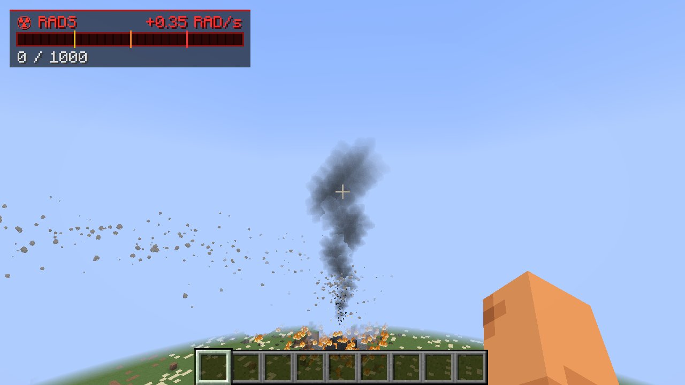

| Before | Seconds after | Earth roof | Concrete roof |
|---|---|---|---|
| 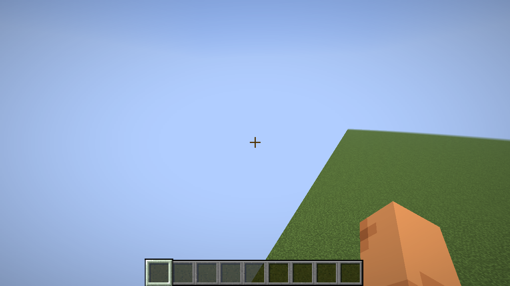 | 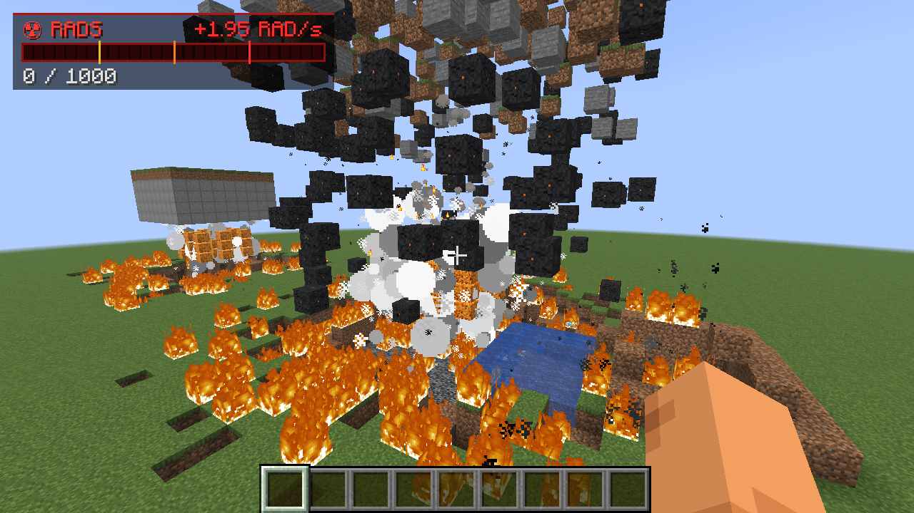 | 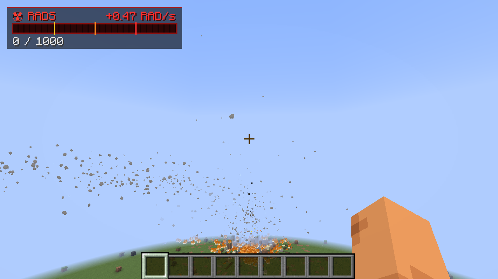 | 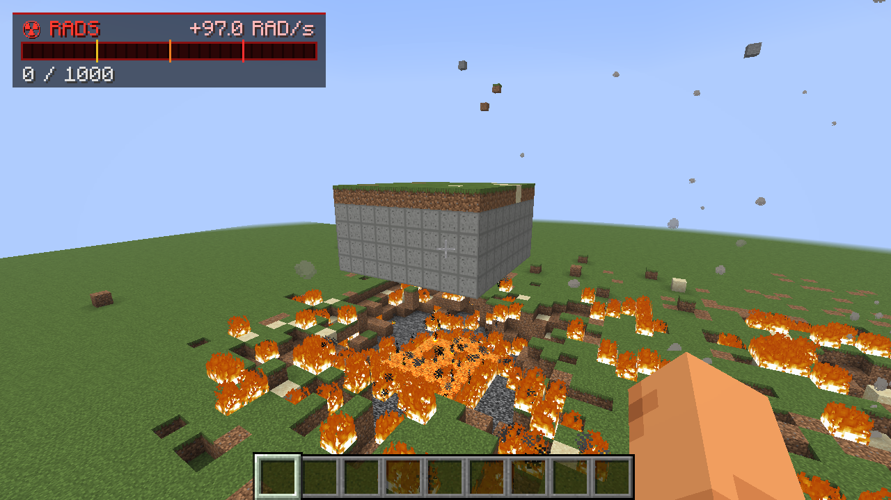 |

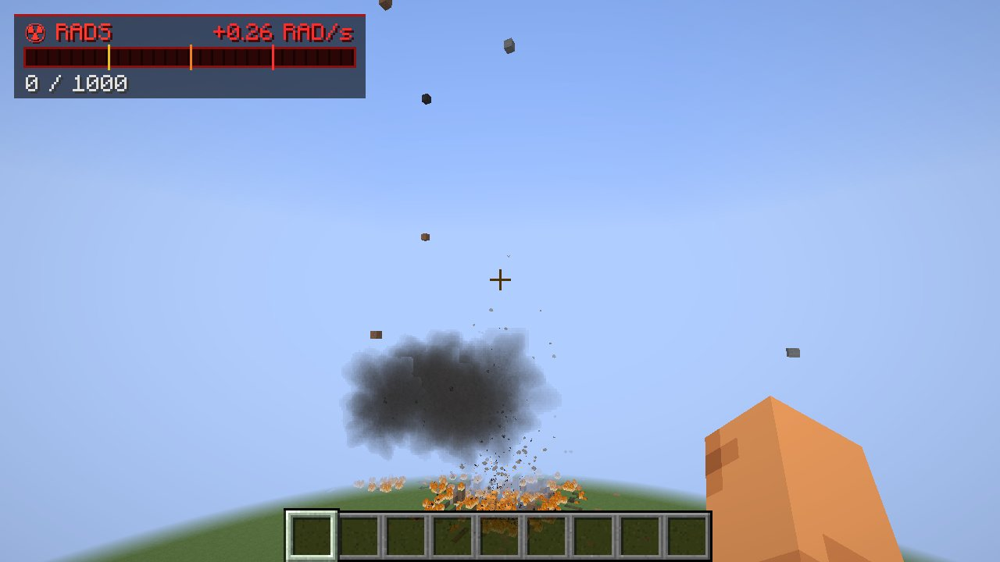

`/fission excursion <controller x y z> [severity]` (operators) makes a reactor go prompt critical at once,
for tests and disaster films.

## Tips

- Fill the core with water before pulling the rods; the protection system will not let you otherwise.
- Start up slowly: watch the period, not the power. Under 30 s is an alarm, under 10 s a SCRAM.
- Put reinforced or heavy concrete around and above the reactor: it shields the radiation of the
  running core (a 27 MW core gives about 200 rad/s at one metre per MW) and holds an explosion.
- Keep feedwater pumps on more than one power source. A station blackout means no cooling.
- Spent fuel stays deadly. Move it by tube, cool it in a basin, never carry it.

## A large plant: Kernkraftwerk Funkstadt

The **DARC Funkstadt** sample map (from the Ham Radio mod) has a full-size plant built with Fission, running when
the map loads. It powers the whole map through Gridworks, including a 500 kW longwave transmitter. See the
[Ham Radio handbook](https://mchamradio.antwire.net/handbook/hamradio/#nuclear-power-plant) for the tour.

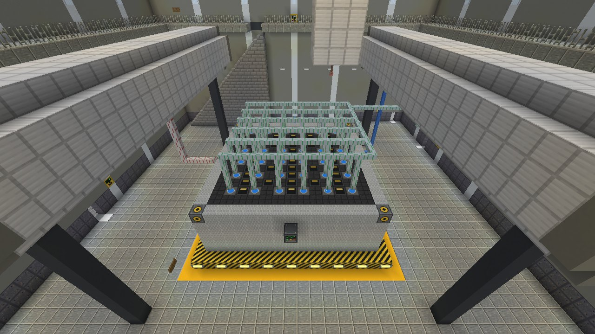

- **Core**: 6 × 6 columns of three LEU fuel channels (108 MW thermal) at pitch 2 in graphite, 43 control rod columns
  (in every gap between four fuel columns, and in three lines between neighbouring fuel columns), a beryllium shell. k = 1.20 with the rods
  out, 0.87 with them in, still 1.11 at half burnup. In AUTO at 15 MW the rods sit at about 42 %.
- **Refuelling**: standpipes on top of every column (1.0.1: assemblies pass up and down through the column), a
  manifold above them, out through the hall wall to the fresh fuel racks and the spent fuel pool.
- **Open, RBMK style** (since the night of 6 October 2026): no containment and no shield. The core stands open on a
  steel pedestal in a windowless concrete, neon-lit reactor hall (as at Chernobyl), its top layers removed so the lattice shows (k drops from
  1.20 to 1.19). Galleries read about 0.4 rad/s, the control room behind the hall's concrete and its own heavy concrete wall under 0.01. Nothing holds an
  excursion any more: see below.
- **Steam and water**: one outlet to four turbine sets and three water-cooled condensers; three feedwater pumps at a
  sea-water intake, powered at 10 kV from the 110 kV grid through a station transformer.

```
 top view of a fuel layer      F fuel channel   R control rod   G graphite   B beryllium
   B B B B B B B B B B B B B B B
   B G G G G G G G G G G G G G B
   B G F R F G F R F G F R F G B
   B G G R G R G R G R G R G G B
   B G F R F G F R F G F R F G B
   B G G R G R G R G R G R G G B
   B G F R F G F R F G F R F G B
   B G G R G R G R G R G R G G B
   B G F R F G F R F G F R F G B
   B G G R G R G R G R G R G G B
   B G F R F G F R F G F R F G B
   B G G R G R G R G R G R G G B
   B G F R F G F R F G F R F G B
   B G G G G G G G G G G G G G B
   B B B B B B B B B B B B B B B
```

### When it goes prompt critical

Tested on the download map with `/fission excursion -98 74 -104` and the wind fixed towards the city
(330°, 5 m/s): the hall roof, 26 blocks above the core, is blown away (168 of 1849 blocks are left, along
the walls); 900 blocks fly up to 180 blocks high, graphite and fuel up to 370 blocks out, and about 300
pieces come down on the plant, its roofs and the fields, setting fires. The cloud reaches the roundabout in
the city centre (257 blocks away) after about 50 seconds: 0.7–0.8 rad/s outdoors while it passes, and
fallout along its track. Close to the plant the ground reads 2 rad/s.

| The explosion | The open core afterwards | The cloud over the city |
|---|---|---|
| 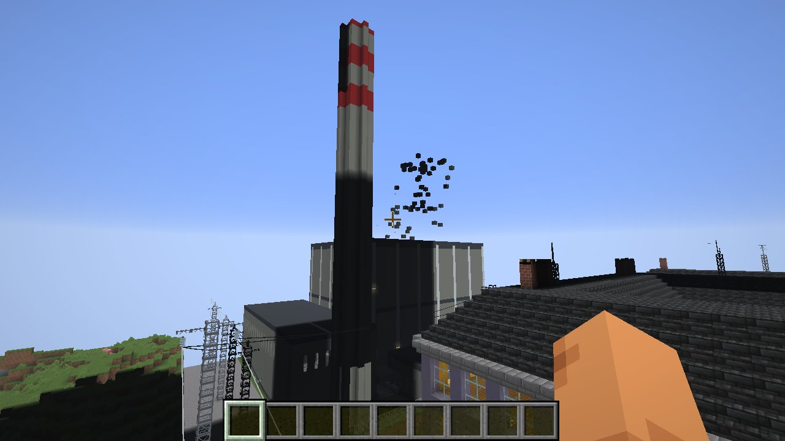 | 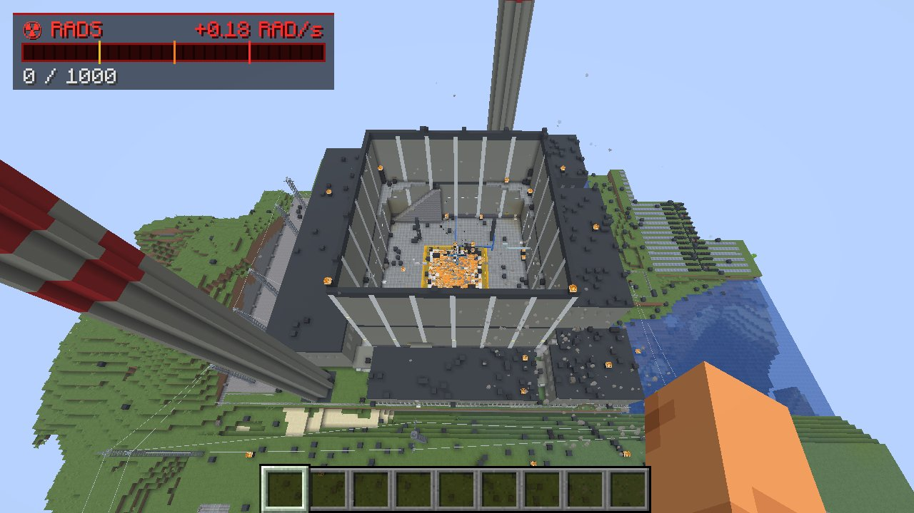 | 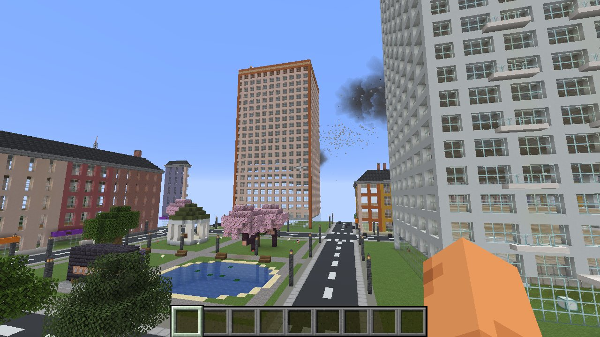 |
| **Debris on the roofs around** | **The trail of the cloud** | **Under the cloud** |
| 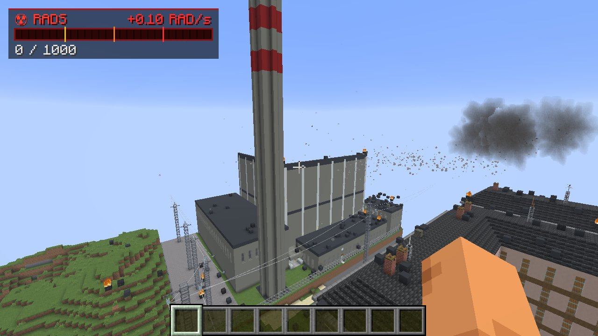 | 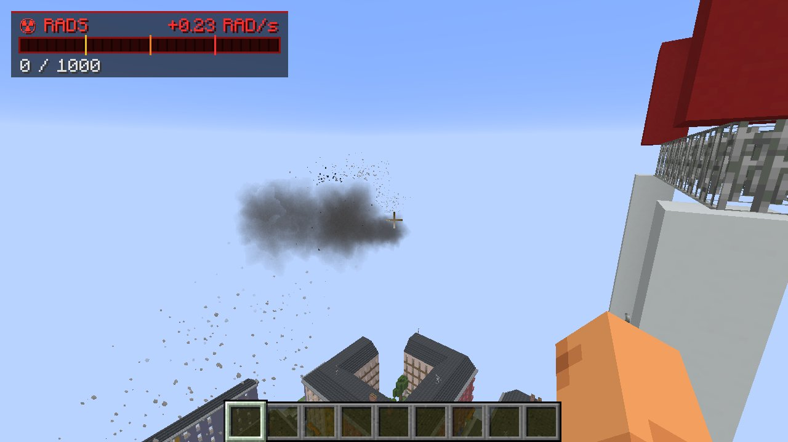 | 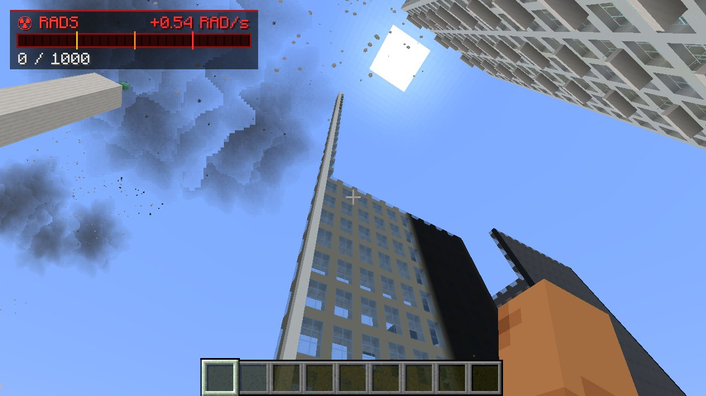 |

## Changes

- **1.2.1**: the smoke column rises 80 blocks and the clouds float about 85 blocks above the ground (about three times higher than before).
- **1.2.0** (needs Radiation 1.5.0): a blown-up core keeps burning, with smoke rising from it and - where it is open
  to the sky - a radioactive cloud every half minute until the fire is smothered (sand, gravel, concrete, water on the
  core) or burns out after ten days; `/fission fires`, `/fission extinguish`. Clouds and wind moved to the Radiation mod
  (`/wind`, `/radiation wind`, `/radiation clouds`), where rain now washes clouds out. The graphite left in the shaft
  is no longer blown away by the core's own blast.

- **1.1.0** (needs Radiation 1.4.0): prompt critical excursions blow away everything that cannot hold the blast in a
  cone up to 64 blocks above the core (a hall roof included), throw irradiated graphite and fuel fragments (new block)
  hundreds of blocks high and far, and release a radioactive cloud that drifts with a made-up wind and leaves decaying
  fallout. `/fission wind`, `/fission clouds`, `/fission excursion`. Severity follows the reactivity. The open core's
  own source is 4 instead of 40 rad/s per channel and fades over days.

- **1.0.1**: a column of stacked fuel channels is one pressure tube, so a tube on top of the column refuels every
  channel in it. Tube routing counts the tubes it travels (up to 2048), not every block it looks at, so pushes no
  longer give up early in large plants.

## Building from source

```
./gradlew build                                # build/libs/fission-1.2.1.jar
./gradlew runClientGameTest [-Pscenes=plant]   # the screenshot tour (plant, fuel, meltdown, explosion, cloud)
./gradlew runClientGameTest -Pmap=<unpacked DARC_Funkstadt> -PmapMods=<hamradio.jar,redbutton.jar>
                                               # the Funkstadt plant goes prompt critical
```

`libs/` holds the Gridworks and Radiation jars it compiles against. `tools/gen_assets.py` generates
textures, models, recipes, worldgen, language files and sounds.

## License

MIT
